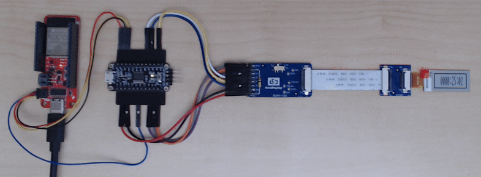

# SparkFun SSD168x I2C Interface Library

A library to support SSD1680/1 e-paper displays on I2C, using a I2C-SPI Bridge.

This library is based heavily on the [SparkFun Qwiic OLED Arduino Library](https://github.com/sparkfun/SparkFun_Qwiic_OLED_Arduino_Library) and includes the same fonts and graphics support.

It has been tested on the GoodDisplay GDEY0154D67 1.54" (200 x 200) and GDEM0097T61 0.97" (184 x 88) e-paper displays.

The I2C to SPI Bridge is configured as a I2C peripheral with five registers:
Single Control (Register 0x00), Control (Register 0x01), Data (Register 0x02), Final Data (Register 0x03) and Reset (Register 0x04).

* A single control byte written to Register 0x00 is bridged to SPI with the D/C# pin held low. CS returns high after the write.
* All data written to Register 0x01 is bridged to SPI with the D/C# pin held low. CS remains low after the write.
* All data written to Register 0x02 is bridged to SPI with the D/C# pin held high. CS remains low after the write.
* All data written to Register 0x03 is bridged to SPI with the D/C# pin held high. CS returns high after the write.
* A write to Register 0x04 causes RST to be pulled low briefly.
* I2C reads return bytes containing the e-paper BUSY flag in the LSB.

The MSP430FR2433 and STM32G03 folders contain example I2C-SPI Bridge firmware, tested on the:
* TI MSP430FR2433 on the MSP-EXP430FR2433 dev board (using TI Code Composer Studio)
* ST STM32G031K8T6 on the NUCLEO-G031K8 dev board (using the Arduino IDE and the STM32 Arduino Board package)
* ST STM32G030F6P6 on a generic dev board (using the Arduino IDE and the STM32 Arduino Board package)

In the above demo animated gif, the hardware is:
* [SparkFun Thing Plus - ESP32 WROOM (USB-C)](https://www.sparkfun.com/sparkfun-thing-plus-esp32-wroom-usb-c.html)
    * Running [Example04_184x88_Rotated_Clock](https://github.com/sparkfun/SparkFun_SSD168x_I2C_Interface_Library/blob/main/examples/Example04_184x88_Rotated_Clock/Example04_184x88_Rotated_Clock.ino)
    * Connected via Qwiic (Wire) to:
* A generic "STM32G030F6P6 Mini Development System Board" - available from online retailers
    * Running the [STM32G030_I2C_SPI_Bridge](https://github.com/sparkfun/SparkFun_SSD168x_I2C_Interface_Library/tree/main/STM32G03/STM32G030_I2C_SPI_Bridge)
    * Programmed using an ST-Link V2 programmer and STM32CubeProgrammer software
* The [GoodDisplay DESPI-C02-CV0097 0.97 inch e-paper 24-Pin to 18 18-Pin adapter board](https://www.good-display.com/product/519.html)
    * Set the sense resistance switch to 2.2 Ohm
* The [GoodDisplay GDEM0097T61 0.97 inch e-paper display](https://www.good-display.com/product/486.html)

Please see [WIRING](./WIRING.md) for the connections

Repository Contents
-------------------

* **/MSP430FR2433** - Example I2C-SPI Bridge firmware for the TI MSP430FR2433
* **/STM32G03** - Example I2C-SPI Bridge firmware for the ST STM32G030F6P6 and STM32G031K8T6
* **/examples** - Example code 
* **/src** - Source code

Documentation
--------------
* **[Wiring](./WIRING.md) - wiring for STM32 programming and display adapter connections
* **[GitHub Repo](https://github.com/sparkfun/TODO)** - TODO: Update URL and description
* **[Hookup Guide](http://docs.sparkfun.com/TODO/)** - TODO: Update URL and description

License Information
-------------------

This product is _**open source**_! 

Please review the LICENSE.md file for license information. 

If you have any questions or concerns on licensing, please contact technical support on our [SparkFun forums](https://community.sparkfun.com/c/components-and-accessories/displays/29).

Distributed as-is; no warranty is given.

- Your friends at SparkFun.

_<COLLABORATION CREDIT>_
